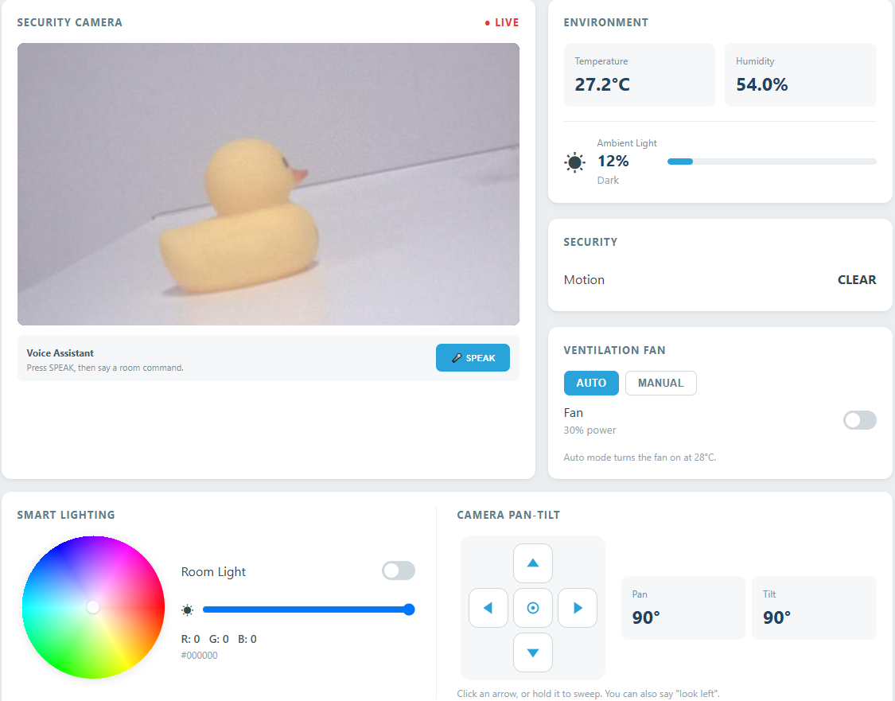
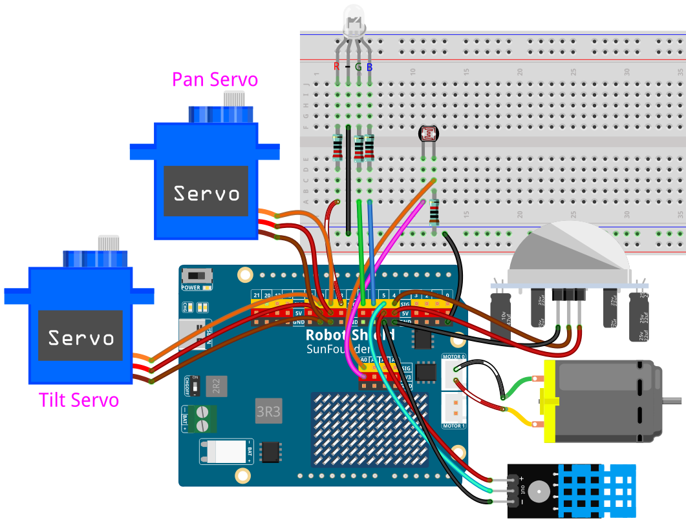

# 12 IoT Smart Room

A complete smart room that watches over itself: the sketch reads the temperature, humidity, light level and motion, while Python mirrors that state in a control panel, drives the fan, the RGB light and the pan-tilt servos, streams the camera, and answers voice commands through STT and TTS.

## Software

### Bricks Used

This example uses the following Bricks:

- `web_ui` — Serves the control panel and pushes the room state, the camera frame, and the voice status to the browser
- `sunfounder_stt` — Local speech-to-text (Whisper model) for the voice commands
- `sunfounder_tts` — Speaks the confirmations and the status report through the speaker

### Libraries Used

- **Arduino_HardwareServo** library — drives the pan and tilt servos with hardware PWM
- **DHT sensor library** — reads the DHT11 temperature and humidity sensor
- **Adafruit Unified Sensor** library — the sensor interface the DHT library builds on

## Hardware

- Pan Tilt Kit ×1
- DHT11 temperature and humidity sensor ×1
- PIR motion sensor ×1
- RGB LED (common cathode) ×1
- 220Ω resistors ×3
- 10kΩ resistor ×1
- Photoresistor module ×1
- Breadboard ×1
- Jumper wires
- USB-C cable ×1
- Arduino App Lab

## Wiring

| Module | UNO Q |
| --- | --- |
| Motor IN1 | D2 |
| Motor IN2 | D3 |
| PIR | D4 |
| DHT11 | D5 |
| RGB LED R | D8 |
| RGB LED G | D7 |
| RGB LED B | D6 |
| Pan Servo | D9 |
| Tilt Servo | D10 |
| Photoresistor | A0 |
| Camera | CSI |

Each RGB channel goes through its own 220Ω resistor, and the photoresistor needs its 10kΩ resistor to GND. The ultrasonic sensor from the radar project is not used here.

## How to Use the Example

1. Download [`12 IoT Smart Room.zip`](https://github.com/sunfounder/unoq-ai-kit/releases/latest/download/12.IoT.Smart.Room.zip).
2. In App Lab, go to **Apps** → **Create New App** → **Import App** → **Import from Computer** and open the package you downloaded.
3. Click **Run**.
4. Open the **Web UI**: the panel shows the temperature, the humidity, the light level, the motion state, the fan mode, the RGB colour wheel, the live camera feed, and the pan-tilt arrow pad.
5. Hold the microphone button and speak one of the commands below — the panel echoes what it heard and the speaker confirms the action.

## How it Works

**Flow**

- Sketch (`sketch.ino`) — reads the DHT11, the photoresistor and the PIR sensor, drives the fan on D2/D3, the RGB LED on D8/D7/D6 and the pan-tilt servos, then reports with `Bridge.notify("environment_update", ...)`
- Python (`main.py`) — mirrors that state in the browser with `ui.send_message("room_state", data)`, streams the camera frame, and reacts to the panel through `ui.on_message(...)` handlers such as `toggle_fan`, `set_fan_mode`, `set_rgb_color` and `pan_tilt_move`
- Bridge — Python commands the hardware with `Bridge.call("set_fan_enabled", ...)`, `Bridge.call("set_rgb_color", r, g, b)`, `Bridge.call("set_system_running", ...)`, the `pan_left` / `pan_right` / `tilt_up` / `tilt_down` / `center` presets, and the `pan_step` / `tilt_step` nudges used by the arrow pad
- Voice — `sunfounder_stt` recognizes the sentence, Python matches a keyword, and `sunfounder_tts` speaks the reply

**The smart room systems**

- **Environment** — the DHT11 measures temperature and humidity; a photoresistor on A0 measures ambient light.
- **Ventilation** — the D2/D3 motor acts as a fan. AUTO mode turns it on at 28°C; MANUAL mode is driven from the Web UI.
- **Security** — PIR motion detection plus the live CSI camera feed.
- **Camera control** — the D9/D10 pan-tilt servos are aimed from the Web UI arrow pad or by voice.
- **Smart lighting** — the RGB LED on D8/D7/D6 follows the colour wheel or a voice command.

## Camera Control

The pan-tilt has no joystick - it is aimed from the Web UI or by voice.

- **Web UI** - the **Camera Pan-Tilt** panel has four arrows and a centre button. One click nudges the servo by 10°; hold an arrow to sweep; the centre button returns both servos to 90°. The Pan and Tilt readouts always show the current angle.
- **Voice** - `Look left`, `Look right`, `Look up` and `Look down` jump straight to the preset angles, and `Center` returns both servos to 90°.

## Voice Commands

- `Fan on` / `Fan off`
- `Light on` / `Light off`
- `Set light red`
- `Set light green`
- `Set light blue`
- `Set light yellow`
- `Set light purple`
- `Set light cyan`
- `Set light white`
- `Set light orange`
- `Set light pink`
- `Look left` / `Look right`
- `Look up` / `Look down`
- `Center`
- `System status`

## Servo Range

- Left: 135°
- Right: 45°
- Up: 45°
- Down: 115°
- Center: 90°
