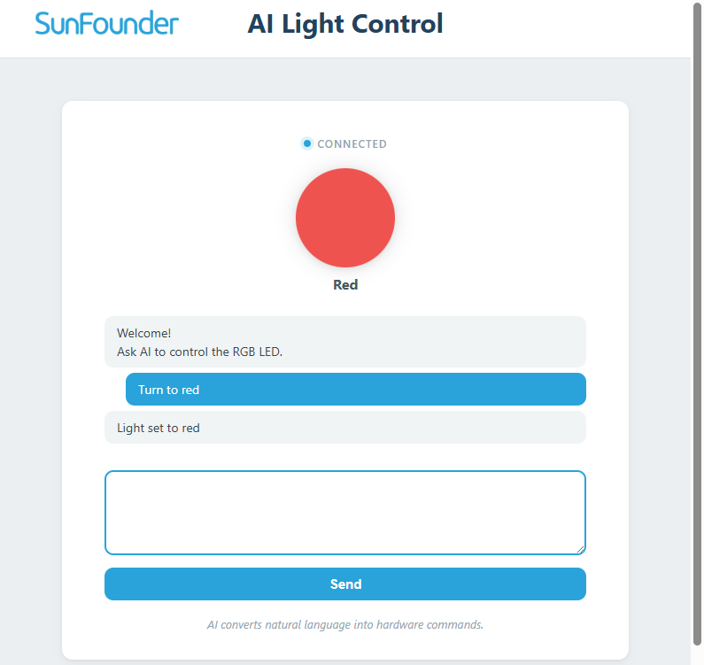

# 01 AI Light Control

Your first AI-powered hardware project. Type a natural-language command — "turn the light red", "make it blue", "switch off" — and an LLM (large language model) translates your words into an RGB LED color.

## Software

### Bricks Used

This example uses the following Bricks:

- `web_ui` — Creates the web interface and keeps the browser in sync with Python
- `cloud_llm` — Sends the prompt to a cloud LLM (OpenAI, Anthropic, or Google) and returns the reply

## Hardware

- Pan Tilt Kit ×1
- Arduino UNO Q ×1
- Breadboard ×1
- RGB LED (common cathode) ×1
- 220Ω resistors ×3
- Jumper wires
- USB-C cable ×1
- Arduino App Lab

## Wiring

Connect the RGB LED through **220Ω resistors** to the Robot Shield PWM channels:

| RGB LED pin | Robot Shield | Resistor |
|-------------|-------------|----------|
| Red         | **D8** | 220Ω    |
| Green       | **D7** | 220Ω    |
| Blue        | **D6** | 220Ω    |
| GND (common)| GND         | —       |

## How to Use the Example

1. Download [`01 AI Light Control.zip`](https://github.com/sunfounder/unoq-ai-kit/releases/latest/download/01.AI.Light.Control.zip).
2. Open **Arduino App Lab**.
3. Select **Apps** → **Create New App** → **Import App** → **Import from Computer**, then choose the package you downloaded.
4. Click **Run**.
5. Ask for a colour in the Web UI and the RGB LED changes to match.

## How it Works

**How it Works**

- Browser — your words: *"turn the light blue"*
- → CloudLLM asks OpenAI GPT-4o mini
- → The model answers with one word: `blue`
- → `Bridge.call("set_color", 3)`
- → Sketch — `setRgb()` writes the three PWM channels
- → RGB LED lights up blue

The model never touches a pin. Python keeps the list of allowed colours, turns the
word into a number, and passes that number across the Bridge; the sketch only
writes the three channels on **D8**, **D7**, and **D6**.
