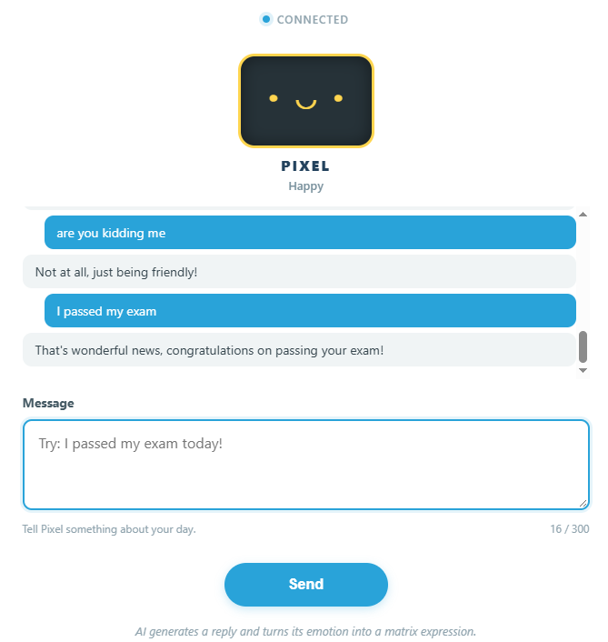

# 02 AI Digital Pet

Chat with Pixel, a friendly AI pet. The LLM writes a short reply and chooses an emotion at the same time. The reply appears in the Web UI, while the matching expression appears on the UNO Q 8×13 LED matrix.

## Software

### Bricks Used

This example uses the following Bricks:

- `web_ui` — Creates the web interface and keeps the browser in sync with Python
- `cloud_llm` — Sends the prompt to a cloud LLM (OpenAI, Anthropic, or Google) and returns the reply

## Hardware

- Pan Tilt Kit ×1
- Arduino UNO Q ×1
- USB-C cable ×1
- A computer running Arduino App Lab

## Wiring

The 8×13 LED matrix is built into the UNO Q board, so no wiring is needed.

## How to Use the Example

1. Download [`02 AI Digital Pet.zip`](https://github.com/sunfounder/unoq-ai-kit/releases/latest/download/02.AI.Digital.Pet.zip).
2. Open **Arduino App Lab**.
3. Select **Apps** → **Create New App** → **Import App** → **Import from Computer**, then choose the package you downloaded.
4. Click **Run**.
5. Say something to the pet in the Web UI — it answers, its mood appears on the LED matrix.

## How it Works

**Emotions**

| Emotion | When it is used |

|---|---|

| `happy` | Positive, exciting, or friendly messages |

| `sad` | Disappointing or upsetting messages |

| `surprised` | Unexpected or amazing messages |

| `thinking` | Questions or thoughtful messages |

| `neutral` | General messages or safe fallback |

**How It Works**

- Browser message
- ↓
- CloudLLM → OpenAI GPT
- ↓
- {"emotion":"happy","reply":"That is wonderful!"}
- ↓
- Python validates the JSON
- ├── Web UI displays the reply
- └── Bridge.call("show_emotion", 1)
- ↓
- UNO Q LED matrix
The System Prompt asks the LLM to return only JSON:

- {
- "emotion": "happy",
- "reply": "Your short reply here."
- }
If the LLM returns invalid JSON or an unsupported emotion, Python safely falls back to `neutral`.
