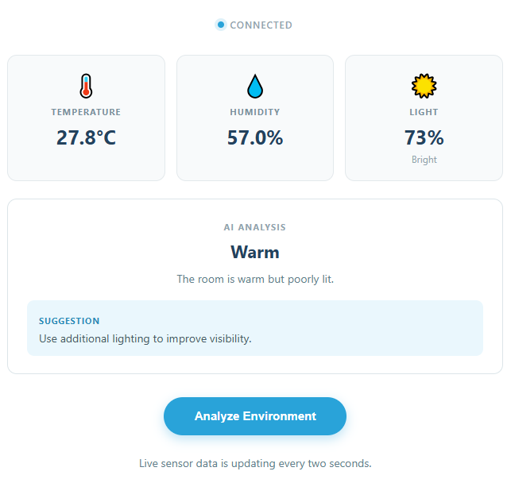

# 03 AI Environment Advisor

Read temperature, humidity, and light data from the real world, then ask an LLM to explain the current environment and provide a practical suggestion.

## Software

### Bricks Used

This example uses the following Bricks:

- `web_ui` — Creates the web interface and keeps the browser in sync with Python
- `cloud_llm` — Sends the prompt to a cloud LLM (OpenAI, Anthropic, or Google) and returns the reply

## Hardware

- Pan Tilt Kit ×1
- Arduino UNO Q ×1
- Robot Shield ×1
- DHT11 temperature and humidity sensor ×1
- Photoresistor module ×1
- USB-C cable ×1
- Jumper wires

## Wiring

| Component | Robot Shield |
|---|---|
| DHT11 signal | D4 |
| DHT11 VCC | 5V |
| DHT11 GND | GND |
| Photoresistor signal | A0 |
| Photoresistor VCC | 5V |
| Photoresistor GND | GND |

## How to Use the Example

1. Download [`03 AI Environment Advisor.zip`](https://github.com/sunfounder/unoq-ai-kit/releases/latest/download/03.AI.Environment.Advisor.zip).
2. Open **Arduino App Lab**.
3. Select **Apps** → **Create New App** → **Import App** → **Import from Computer**, then choose the package you downloaded.
4. Click **Run**.
5. The Web UI shows the readings, the model's analysis, and the action it recommends.

## How it Works

**How It Works**

- DHT11 + Photoresistor
- → Arduino reads sensors every 2 seconds
- → Bridge.notify()
- Python stores the latest readings
- → Web UI displays live data
- → User clicks Analyze
- CloudLLM analyzes one snapshot
- → Status + Summary + Suggestion
The LLM returns JSON such as:

- {
- "status": "Warm",
- "summary": "The room is warmer than a typical comfortable range.",
- "suggestion": "Open a window or improve air circulation."
- }

