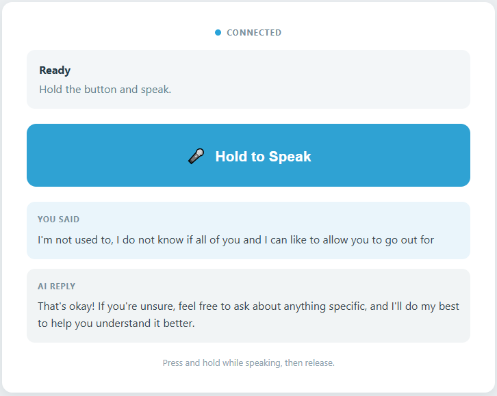

# 04 AI Voice Assistant

A minimal voice assistant example for Arduino App Lab and RobotShield.

## Software

### Bricks Used

This example uses the following Bricks:

- `web_ui` — Creates the web interface and keeps the browser in sync with Python
- `cloud_llm` — Sends the prompt to a cloud LLM (OpenAI, Anthropic, or Google) and returns the reply
- `sunfounder_stt` — Turns your spoken sentence into text locally with Whisper
- sunfounder_tts — Speaks the reply through the Multimedia Carrier's speaker (the voice is synthesised online, but no API key is needed)

- sunfounder_tts — Speaks the reply through the Multimedia Carrier's speaker (the voice is synthesised online, but no API key is needed)

## Hardware

- Pan Tilt Kit ×1

## Wiring

No breadboard wiring is needed — everything is built into the Multimedia Carrier.

## How to Use the Example

1. Download [`04 AI Voice Assistant.zip`](https://github.com/sunfounder/unoq-ai-kit/releases/latest/download/04.AI.Voice.Assistant.zip).
2. Open **Arduino App Lab**.
3. Select **Apps** → **Create New App** → **Import App** → **Import from Computer**, then choose the package you downloaded.
4. Click **Run**.
5. Hold the button in the Web UI and speak — the assistant answers out loud and shows the same reply on screen.

## How it Works

**Workflow**

- Hold the web button
- ↓
- RobotShield microphone
- ↓
- sunfounder_stt
- ↓
- CloudLLM
- ↓
- sunfounder_tts
- ↓
- RobotShield speaker

**Important implementation details**

The project uses the real APIs from:

At startup it creates the audio directory required by both STT and TTS:

- os.makedirs("/app/audio_output", exist_ok=True)
- os.makedirs("./audio_output", exist_ok=True)
It also configures the RobotShield microphone and speaker:

The physical USR button is not used.
