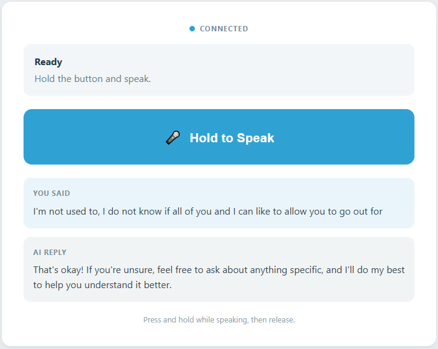

# 04 AI Voice Assistant

A minimal voice assistant example for Arduino App Lab and RobotShield.

## Software

### Bricks Used

This example uses the following Bricks:

- `web_ui` — Creates the web interface and keeps the browser in sync with Python
- `cloud_llm` — Sends the prompt to a cloud LLM (OpenAI, Anthropic, or Google) and returns the reply
- `sunfounder_stt` — Sends the recording to online OpenAI Whisper and returns the recognized text
- `sunfounder_tts` — Speaks the reply through the AVIO Carrier's speaker (the voice is synthesised online, but no API key is needed)

## Hardware

- Pan Tilt Kit ×1

## Wiring

No breadboard wiring is needed — everything is built into the AVIO Carrier.

## How to Use the Example

1. Download [`04 AI Voice Assistant.zip`](https://github.com/sunfounder/unoq-ai-kit/releases/latest/download/04.AI.Voice.Assistant.zip).
2. Open **Arduino App Lab**.
3. Select **Apps** → **Create New App** → **Import App** → **Import from Computer**, then choose the package you downloaded.
4. Enter an OpenAI API key for **Cloud LLM**.
5. Enter an OpenAI API key for **OpenAI Speech to Text**. The same OpenAI key can be used in both fields.
6. Make sure the UNO Q has Internet access, then click **Run**.
7. Hold the button in the Web UI and speak. Release it when you finish; the assistant answers aloud and shows the reply on screen.

## How it Works

**Workflow**

- Hold the web button
- ↓
- RobotShield microphone
- ↓
- OpenAI Whisper STT
- ↓
- Recognized text
- ↓
- CloudLLM
- ↓
- AI reply
- ↓
- RobotShield speaker

**Important implementation details**

At startup it creates the audio directory required by both STT and TTS:

- os.makedirs("/app/audio_output", exist_ok=True)
- os.makedirs("./audio_output", exist_ok=True)
The physical USR button is not used.

Online STT and the Cloud LLM require an Internet connection. Local Whisper model files are not included, which keeps the app package much smaller.
