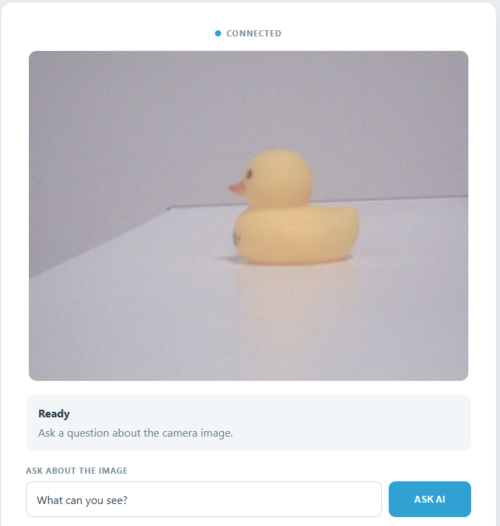

# 05 AI Vision Assistant

Use the camera on the AVIO Carrier and a Vision Language Model to answer questions about the current image. The answer appears in the Web UI and is also read aloud.

## Software

### Bricks Used

This example uses the following Bricks:

- `cloud_llm` — Sends the prompt to a cloud LLM (OpenAI, Anthropic, or Google) and returns the reply
- `web_ui` — Creates the web interface with the camera preview and the answer panel
- `sunfounder_tts` — Reads the answer out loud through the AVIO Carrier's speaker

## Hardware

- Pan Tilt Kit ×1
- Arduino UNO Q
- camera on the AVIO Carrier
- RobotShield speaker or another supported audio output

## Wiring

No breadboard wiring is needed — everything is built into the AVIO Carrier.

## How to Use the Example

1. Download [`05 AI Vision Assistant.zip`](https://github.com/sunfounder/unoq-ai-kit/releases/latest/download/05.AI.Vision.Assistant.zip).
2. Open **Arduino App Lab**.
3. Select **Apps** → **Create New App** → **Import App** → **Import from Computer**, then choose the package you downloaded.
4. Click **Run**.
5. Point the camera at something and ask a question in the Web UI — the answer appears there.

## How it Works

**How It Works**

- Camera on the AVIO Carrier + Text Question
- → Vision-Capable Cloud LLM
- → Answer on Web UI
- → Text-to-Speech
The camera continuously supplies the live preview. Clicking **ASK AI** saves

the latest frame in memory and sends that image together with the typed

question to GPT-4o mini through the Cloud LLM Brick. The reply is displayed

and spoken.

The camera source is flipped vertically before both preview and AI analysis,

so the displayed image and the image examined by the AI have the same upright

orientation.
