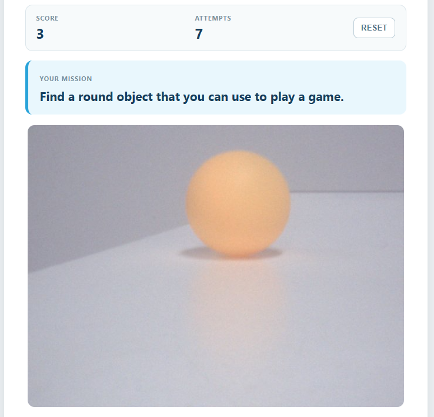

# 06 AI Scavenger Hunt

The AI writes a scavenger-hunt mission, you show an object to the camera, and a vision-capable LLM judges whether it matches. The RGB LED, buzzer, Web UI, and TTS all report the result.

## Software

### Bricks Used

This example uses the following Bricks:

- `web_ui` — Serves the game page and pushes the mission, score, and result to the browser
- `cloud_llm` — Writes the mission text and judges the camera image (OpenAI GPT-4o mini)
- `sunfounder_tts` — Reads each mission and the referee's message aloud through the speaker

## Hardware

- Pan Tilt Kit ×1
- Arduino UNO Q ×1
- Breadboard ×1
- RGB LED (common cathode) ×1
- 220Ω resistors ×3
- Buzzer ×1
- Jumper wires
- USB-C cable ×1
- Arduino App Lab

## Wiring

Connect the RGB LED through **220Ω resistors** to the Robot Shield PWM channels, and the buzzer to **D5**:

| Component | Robot Shield | Resistor |
|-----------|--------------|----------|
| Red | **D8** | 220Ω |
| Green | **D7** | 220Ω |
| Blue | **D6** | 220Ω |
| GND (common cathode) | GND | — |
| Buzzer + | **D5** | — |
| Buzzer − | GND | — |

## How to Use the Example

1. Download [`06 AI Scavenger Hunt.zip`](https://github.com/sunfounder/unoq-ai-kit/releases/latest/download/06.AI.Scavenger.Hunt.zip).
2. Open **Arduino App Lab**.
3. Select **Apps** → **Create New App** → **Import App** → **Import from Computer**, then choose the package you downloaded.
4. Click **Run**.
5. Press **NEW MISSION**, show the requested object to the camera, then press **CHECK OBJECT** — a match turns the LED green and adds one point.

## How it Works

**How It Works**

- Browser — **NEW MISSION**
- → Python asks the Cloud LLM for one safe mission
- → Mission text and live camera preview in the Web UI, spoken by TTS
- → Browser — **CHECK OBJECT**
- → Python sends the current frame and the mission to the vision-capable LLM
- → `Bridge.call("game_feedback", code)`
- → RGB LED and buzzer report the verdict

The mission generator is told to answer with one short sentence that starts with
"Find", so Python only has to clean the reply instead of parsing it. The referee
returns strict JSON — `{"success": true, "message": "..."}` — which tells Python
whether to add a point and what to say. The sketch owns only the feedback:
`game_feedback(1)` draws the LED green and plays two high tones, `game_feedback(2)`
draws it red and plays one low tone, and `game_feedback(3)` resets both. The
camera frame is flipped vertically before it is used, so the preview and the image
the model receives have the same upright orientation.
