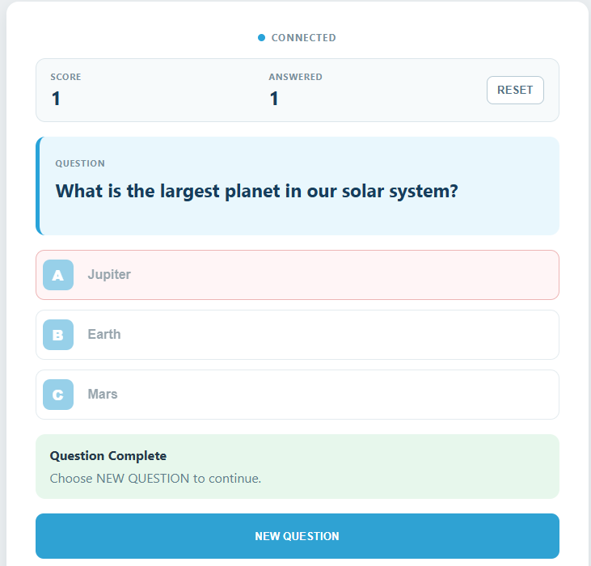
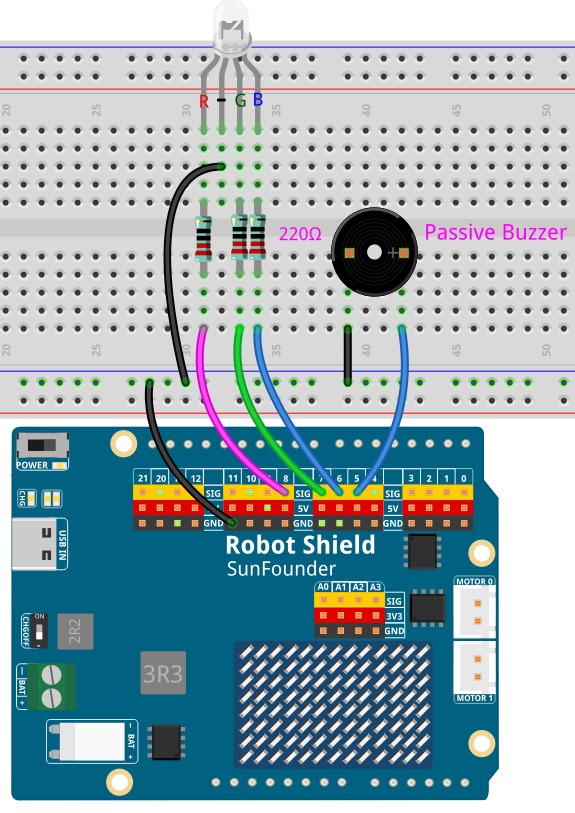

# 07 AI Quiz Show

The AI creates a new three-choice general-knowledge question every round. TTS reads it aloud, you answer with the A/B/C buttons in the Web UI, and the RGB LED, buzzer, speaker, and scoreboard give immediate feedback.

## Software

### Bricks Used

This example uses the following Bricks:

- `web_ui` — Serves the quiz page with the question, the A/B/C buttons, and the scoreboard
- `cloud_llm` — Creates the question, its three choices, the correct letter, and a short explanation
- `sunfounder_tts` — Reads the question and the feedback aloud through the speaker

## Hardware

- Pan Tilt Kit ×1
- Arduino UNO Q ×1
- Breadboard ×1
- RGB LED (common cathode) ×1
- 220Ω resistors ×3
- Passive buzzer ×1
- Jumper wires
- USB-C cable ×1
- Arduino App Lab

## Wiring

Connect the RGB LED through **220Ω resistors** to the Robot Shield PWM channels, and the passive buzzer to **D5**:

| Component | Robot Shield | Resistor |
|-----------|--------------|----------|
| Red | **D8** | 220Ω |
| Green | **D7** | 220Ω |
| Blue | **D6** | 220Ω |
| GND (common cathode) | GND | — |
| Buzzer + | **D5** | — |
| Buzzer − | GND | — |

## How to Use the Example

1. Download [`07 AI Quiz Show.zip`](https://github.com/sunfounder/unoq-ai-kit/releases/latest/download/07.AI.Quiz.Show.zip).
2. Open **Arduino App Lab**.
3. Select **Apps** → **Create New App** → **Import App** → **Import from Computer**, then choose the package you downloaded.
4. Click **Run**.
5. Press **NEW QUESTION**, listen to the question, then answer with **A**, **B**, or **C**.

## How it Works

**How It Works**

- Browser — **NEW QUESTION**
- → Python asks the Cloud LLM for JSON: a question, three choices, the correct letter, and an explanation
- → Web UI shows the question and enables the A/B/C buttons, and TTS reads it aloud
- → Browser — the player picks **A**, **B**, or **C**
- → Python compares the letter locally, with no second cloud request
- → `Bridge.call("quiz_feedback", code)`
- → RGB LED and buzzer report the result, then the scoreboard updates

The Cloud LLM is asked for strict JSON, and Python keeps only the rounds whose
question, choices, and answer letter are all present, so a malformed reply never
reaches the page. Because the correct letter is known locally, checking an answer
costs no extra request. The sketch owns the feedback: `quiz_feedback(1)` draws the
LED green and plays two high tones, `quiz_feedback(2)` draws it red and plays one
low tone, and `quiz_feedback(3)` resets both.
