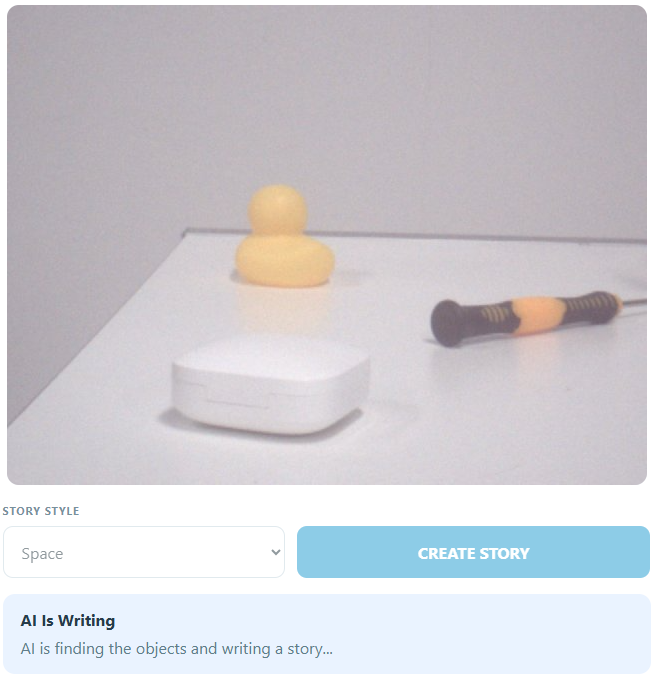

# 08 AI Story Dice

Place two or three everyday objects in front of the camera and choose a story style — a vision-capable LLM identifies the objects and writes a short story about them. The speaker narrates the story while the UNO Q LED matrix shows its mood. No external wiring is required.

## Software

### Bricks Used

This example uses the following Bricks:

- `web_ui` — Serves the page with the live camera preview, the identified objects, and the generated story
- `cloud_llm` — Reads the captured image and returns the objects, a title, a three-sentence story, and its mood as JSON
- `sunfounder_tts` — Narrates the finished story through the speaker

## Hardware

- Pan Tilt Kit ×1
- Arduino UNO Q ×1
- camera on the AVIO Carrier
- RobotShield speaker or another supported audio output
- USB-C cable ×1
- Arduino App Lab

## Wiring

No breadboard wiring is needed — the camera is built into the AVIO Carrier and the mood display is the UNO Q's built-in LED matrix.

## How to Use the Example

1. Download [`08 AI Story Dice.zip`](https://github.com/sunfounder/unoq-ai-kit/releases/latest/download/08.AI.Story.Dice.zip).
2. Open **Arduino App Lab**.
3. Select **Apps** → **Create New App** → **Import App** → **Import from Computer**, then choose the package you downloaded.
4. Click **Run**.
5. Put two or three objects in view, choose a story style, and press **CREATE STORY**.

## How it Works

**How It Works**

- Camera on the AVIO Carrier + a story style chosen in the Web UI
- → Python captures one frame and sends it to the vision-capable cloud LLM
- → The Web UI shows the identified objects, the title, and the story
- → TTS narrates the story
- → `Bridge.call("show_story_mood", code)`
- → The built-in LED matrix draws the matching face

The model answers with strict JSON, so Python receives the object list, the story
text, and one mood word in a single reply. The mood word is mapped to a small
integer — `0` calm, `1` happy, `2` mysterious, or `3` exciting — and the sketch
draws the matching face on the LED matrix with `matrix.draw()`. The camera frame is
flipped vertically before it is sent, so the preview and the image the model
analyses have the same upright orientation.
